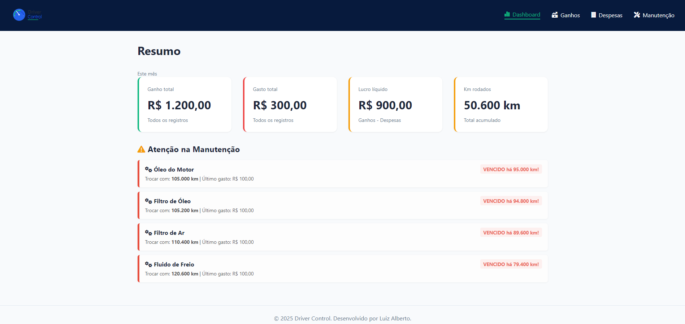
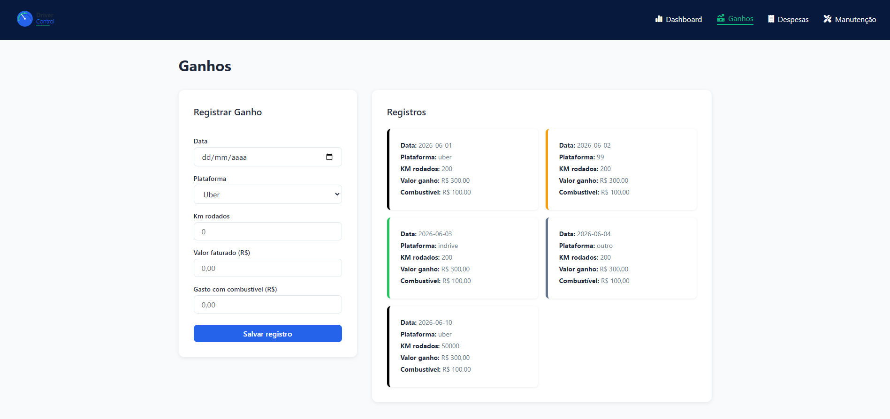
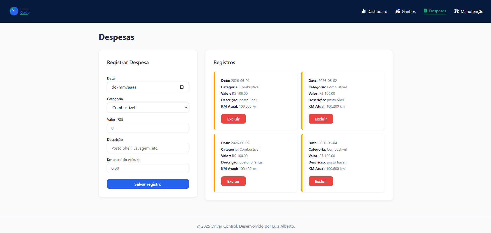
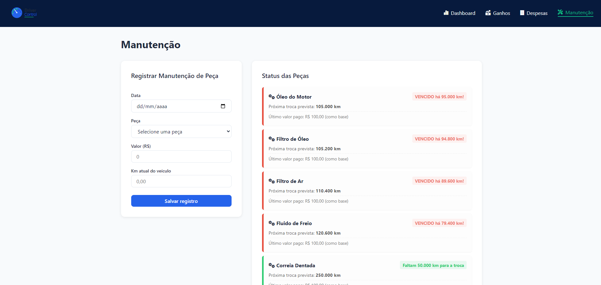

# Driver Control — gestão para motoristas de aplicativo

Aplicação web para acompanhar **ganhos, despesas, quilômetros percorridos e manutenção do veículo**, com funcionamento local no navegador.

[**Ver demonstração**](https://luizalbertodev.github.io/driver-control/) · [**Ver código**](https://github.com/LuizAlbertoDev/driver-control)



## O problema

Motoristas de aplicativo precisam acompanhar receitas e custos do veículo para compreender o resultado do trabalho. O Driver Control reúne essas informações em uma interface simples.

## Funcionalidades

- **Dashboard:** resumo de ganhos, gastos, resultado líquido e quilometragem.
- **Ganhos:** registros por data, plataforma e informações da corrida.
- **Despesas:** lançamento de custos como combustível, pedágios e alimentação.
- **Manutenção:** acompanhamento de serviços e alertas baseados na quilometragem.
- **Interface responsiva:** acesso pelo computador e celular.

## Tecnologias utilizadas nesta versão

- HTML5
- CSS3 (Flexbox e variáveis CSS)
- JavaScript puro (ES6+)
- LocalStorage para armazenamento no próprio navegador
- Font Awesome para ícones

> **Escopo atual:** esta versão é uma aplicação frontend, **sem React, backend Node.js, PostgreSQL ou autenticação de usuários**. Os dados ficam salvos no navegador/dispositivo utilizado; não há sincronização entre aparelhos.

## Como executar

1. Clone o repositório:

   ```bash
   git clone https://github.com/LuizAlbertoDev/driver-control.git
   ```

2. Abra a pasta `driver-control`.
3. Abra `index.html` no navegador.

Não é necessário instalar dependências ou executar um servidor para a versão atual.

## Telas

| Dashboard | Ganhos |
| --- | --- |
|  |  |

| Despesas | Manutenção |
| --- | --- |
|  |  |

## Próximos passos (planejados, ainda não implementados)

- [ ] Criar backend com Node.js e uma API REST.
- [ ] Persistir dados em PostgreSQL.
- [ ] Implementar autenticação real.
- [ ] Migrar a interface para React/TypeScript.
- [ ] Adicionar testes automatizados e publicação com backend.

## Sobre

Projeto de estudos e portfólio, com documentação da **versão realmente disponível neste repositório**.

[GitHub](https://github.com/LuizAlbertoDev) · [LinkedIn](https://www.linkedin.com/in/luizalbertodev/)
